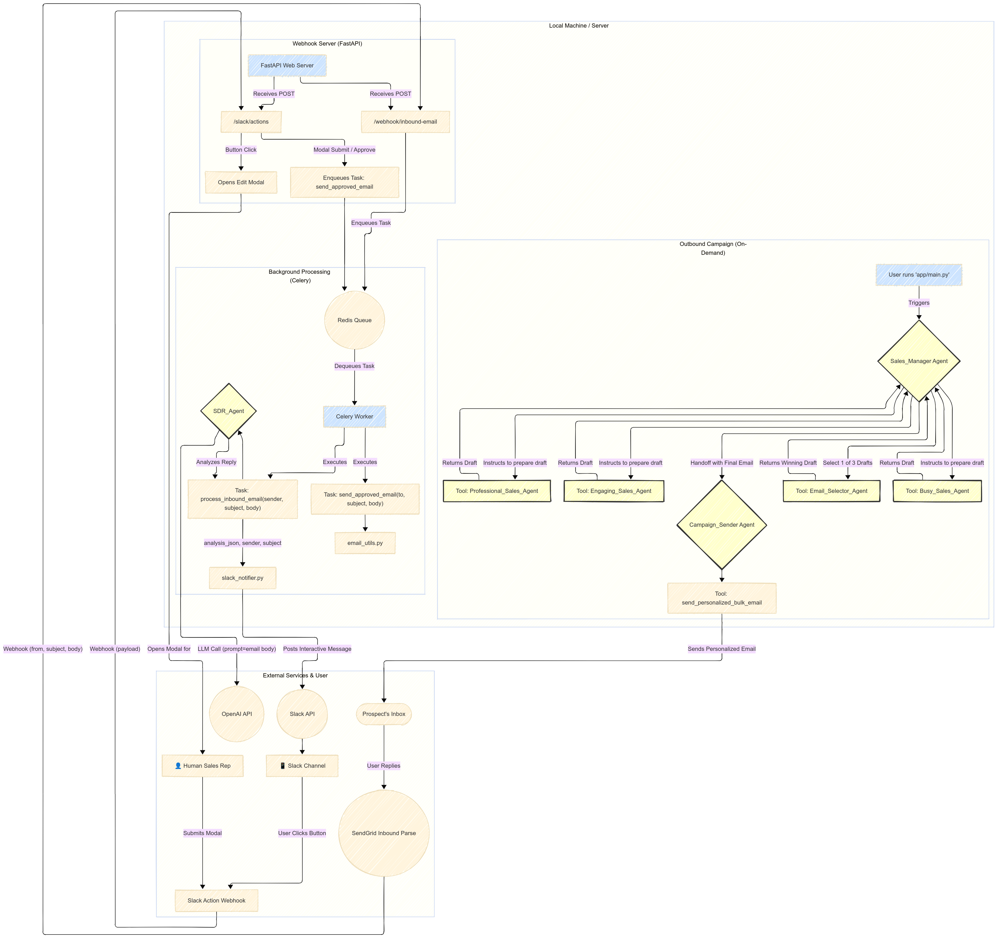

# **🤖 Agentic Sales Co-Pilot**

An autonomous, multi-agent system designed to automate sales email outreach, intelligently process replies, and provide a human-in-the-loop interface for sales representatives via Slack. This version is fully containerized with Docker for consistent, one-command setup and deployment.

## **🚀 Core Features (Current Version)**

* **Autonomous Email Campaign Creation:** A Sales_Manager agent orchestrates a team of specialized agents to generate multiple email drafts, select the best one, and delegate the sending of personalized cold emails. 
* **Personalized Bulk Emailing:** Sends personalized emails to a list of prospects from a .csv file, using placeholders for both the subject and body.
* **Asynchronous Task Queue:** Utilizes **Celery** and **Redis** to offload long-running AI and email-sending tasks, ensuring the web server remains fast and responsive.
* **Intelligent Reply Processing:** Automatically receives email replies via a SendGrid webhook. A dedicated SDR_Agent then analyzes the reply's content to classify its intent and summarize its key points.  
* **Interactive Human-in-the-Loop (HITL) Interface:** The agent's analysis is sent as an interactive notification to a Slack channel, allowing a human user to take action.  
* **One-Click Actions:** From Slack, a user can:  
  * **Approve & Send:** Immediately send the AI-drafted reply.  
  * **Edit & Send:** Open a pop-up modal to edit the draft before sending.  
  * **Discard:** Mark the reply as handled without taking further action.
* **Containerized Environment:** The entire application stack (web server, background worker, Redis) is managed by **Docker and Docker Compose**, ensuring a consistent and reproducible environment.
* **Structured Logging:** All application events are logged in a structured **JSON format** for easy monitoring and debugging. 
* **Secure & Configurable:** Manages all secret keys and configuration safely through environment variables.

## **Diagram: System Architecture**

This diagram illustrates the complete, end-to-end workflow of the application, from outbound campaign to inbound reply processing.

## **🛠️ Tech Stack & Key Libraries**

* **Containerization:** Docker, Docker Compose
* **Agent Framework:** agents (OpenAI Agents SDK)  
* **Language:** Python 3.12+  
* **Package Management:** Poetry  
* **Web Framework:** FastAPI  
* **Task Queue:** Celery  
* **Message Broker:** Redis  
* **Email Service:** SendGrid  
* **User Interface:** Slack SDK  
* **Local Tunneling (Development):** ngrok

## **⚙️ Setup and Installation**

Follow these steps to set up the project locally.

### **Prerequisites**

* **Docker & Docker Compose:** You must have Docker installed on your system. Docker Desktop for Windows and Mac includes Docker Compose. [Install Docker](https://docs.docker.com/get-docker/).  
* **Git:** For cloning the repository.  
* **Poetry:** For local dependency management if you wish to run outside of Docker.

### **1. Clone the Repository**

- `git clone <your-repository-url>`
- `cd <your-repository-name>`

### **2. Install Dependencies**

This project uses Poetry for dependency management. Ensure you have Poetry installed, then run:

`poetry install`

### **3. Configure Environment Variables**

Create a file named .env in the root of the project directory. This file stores all your secret keys and configuration.

#### .env

#### --- API Keys ---  
OPENAI_API_KEY="sk-..."  
SENDGRID_API_KEY="SG. ..."  
SLACK_BOT_TOKEN="xoxb-..."

#### --- Configuration ---  
SLACK_CHANNEL_ID="C0..." # The ID of the Slack channel for notifications

### **4. Set Up External Services**

* **SendGrid:**  
  1. Create an API Key with full access to Mail Send.  
  2. Verify a "Single Sender" email address (e.g., business@yourdomain.com).  
  3. Set up **Inbound Parse** on a subdomain (e.g., replies.yourdomain.com) and point its Destination URL to your ngrok forwarding URL.  
  4. Add the provided MX record (mx.sendgrid.net) to your domain's DNS settings for that subdomain.  
* **Slack:**  
  1. Create a new Slack App named "SDR Agent Notifier".  
  2. Add the chat:write and commands Bot Token Scopes under "OAuth & Permissions".  
  3. Install the app to your workspace and copy the Bot User OAuth Token.  
  4. Enable "Interactivity & Shortcuts" and set the Request URL to your ngrok forwarding URL.  
  5. Invite the bot to your designated channel using /invite @Bot/App Name.

### **5. Create the Prospect List**

Create a file named prospects.csv in the project root. It must contain headers that match the placeholders used in the email templates (e.g., FirstName, Company, Position).

FirstName,LastName,Email,Company,Position  
Jane,Doe,jane.doe@example.com,Example Corp,CTO

## **▶️ Running the Application (with Docker Compose)**

Thanks to Docker Compose, the complex multi-terminal setup is now managed with a single command. However, you still need ngrok to expose your local services to the internet for development.

### **Terminal 1: Start the Entire Application Stack**

This single command will build your application's Docker image and start the web server, the worker process, and the redis database, showing you all the logs in one place.

`docker compose up --build`

*Use --build the first time or anytime you change the code to ensure the image is up-to-date.*

### **Terminal 2: Start the ngrok Tunnel**

While the application is running inside Docker, it's still on your local machine. You need to expose the web server's port (8000) to the internet.

# Replace with your static domain if you have one  
`ngrok http 8000 --domain <your.static.domain.ngrok-free.app>`

### **Running an Outbound Campaign (On-Demand)**

Once the services are running via docker-compose up, you can trigger a new email outreach campaign at any time by running the following command in a **new, third terminal**:

`docker compose run --rm worker poetry run python -m app.main`

* **docker-compose run --rm worker**: This command tells Docker to start a *new, temporary* container using the worker service's configuration, run a command inside it, and then remove the container (--rm) when it's done. This is the correct way to run one-off tasks.

## **🔮 Future Work & Roadmap**

* **State Management & Memory:** Implement a database (e.g., SQLite) to store conversation history, giving the SDR_Agent context for multi-turn conversations.
